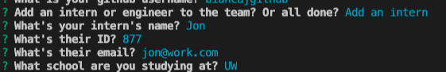

### About Team Profile Generator

Table of Contents

  <ol>
    <li><a href="#description">Description</a></li>
    <li><a href="#technologies">Technologies</a></li>
    <li><a href="#installation">Installation</a></li>
    <li><a href="#usage">Usage</a></li>
  </ol>

## Description

This application will build a team revolving around one team manager and either interns or engineers. The result will be an html file with cards displaying the team members' information.

## Technologies

Built with JavaScript and Node.JS. Inquire was used to take user input and the fs library to write a file. 

## Installation

Node.js installation required. 

## Usage

Demo video to see the generator in action: https://vimeo.com/670988027/aa62d6dd6b

Open the folder contained the index.js file in your command line interface. Use the command, "node index.js". Answer the questions for each of the members. 

Proceed to add another member to the team or exit the application by choosing "I'm all done!".

 An index.html file will generate in the root folder with team members provided in a formatted web page.

 

 

